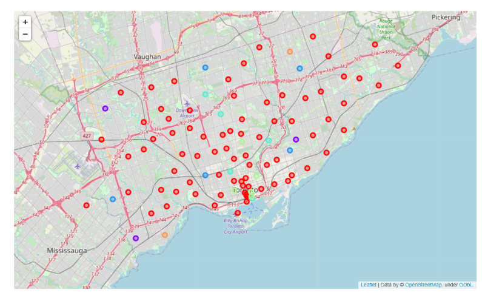

# ML_Clustering_Location

Opening a successful independent pharmacy is a challenging undertaking for any entrepreneur, especially with the competitiveness of today’s retail pharmacy market.
Questions for an entrepreneur

## Location
Are there other pharmacies/chains/independents in the market?
## Traffic
Do pharmacy customers regularly travel through this area?
## Opportunity
Are there nearby businesses, such as medical offices, that will provide a constant flow (medical refills) of potential customers?
## Access
Can people easily enter and exit? Is there plenty of parking?
## Size
Can your pharmacy grow in this location?

## Data:
List of Neighborhood

Location information

Existing pharmacies in the neighborhood

## Source:
Wikipedia: https://en.wikipedia.org/wiki/Special_wards_of_Tokyo#List_of_postal_codes_of_Canada:_M

Geospatial data: http://cocl.us/Geospatial_data

Foursquare APIs

## Results

